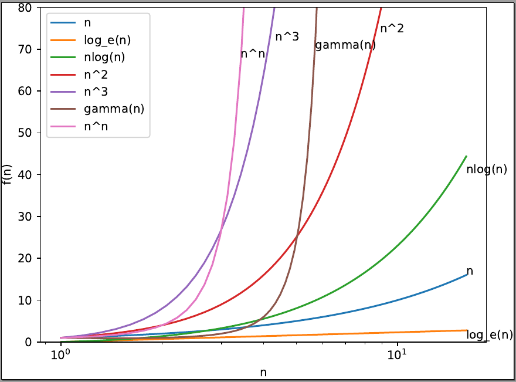

# Corso *Algoritmi e Strutture Dati*: Laboratorio

I sorgenti indicati nelle istruzioni sono contenuti in `code-python/`.

<!--

## Lab 04: plotting

1. *[Tempo stimato: 60']* Si utilizzi `matplotlib` per costruire un'immagine simile a quella sottostante
    * Si faccia riferimento alle slide, al [cheatsheet](https://matplotlib.org/cheatsheets/cheatsheets.pdf), alla [guida](https://matplotlib.org/stable/users/explain/quick_start.html), e alla [API Reference](https://matplotlib.org/stable/api/index.html) 
    * Si faccia anche riferimento agli esempi inclusi in [code-python/mpl/](code-python/mpl/)
    * Alcune indicazioni:
        * Si stabilisca un array di funzioni: `functions = [float, math.log, lambda n: n*math.log(n), ...]`
        * Si usi `x_points = np.linspace(...)` per individuare i valori dell'asse `x` da produrre
        * Si produca i punti da graficare per ogni funzione con qualcosa del tipo:
        `y_points = np.array([some_function(x) for x in x_points])`
        * Si plotti `plot(x_points, y_points)`
        * Si può voler limitare l'asse y mediante la funzione `ylim(min,max)`
    * Nota: la funzione [gamma](https://en.wikipedia.org/wiki/Gamma_function) è una generalizzazione del fattoriale su valori reali
        * In Python: `math.gamma()`
-->

## Lab 03: Misura dei tempi d'esecuzione di funzioni

Si svolgano i seguenti esercizi:

0. *[Tempo stimato: 15']* Consultare la pagina [TimeComplexity (python.org)](https://wiki.python.org/moin/TimeComplexity) che documenta la complessità in tempo di varie operazioni su strutture dati nell'implementazione Python `CPython`. Ci si concentri in particulare sulle operazioni su `list`e.
    - Si noti come sia importante per chi programma in un linguaggio conoscere la complessità delle funzioni che utilizza.
1. *[Tempo stimato: 30']* Si consideri `03-measure-fib.py`. Si misuri e si confronti il tempo d'esecuzione di `fib` (Fibonacci in versione ricorsiva) e `fib_iter` (Fibonacci in versione iterativa). Si utilizzino i *millisecondi* come unità di misura.
    * Si definisca una funzione `measure_running_time(f)` che restituisca il tempo d'esecuzione della funzione `f` fornita in input e la si applichi a `fib` e `fib_iter` per input 10, 20, 30.
        * Si implementi la funzione in due varianti: una usando `time.perf_counter()` e l'altra usando `timeit.repeat`
    * Quale tra `fib` e `fib_iter` dà luogo a tempi d'esecuzione minori?
2. *[Tempo stimato: 15']* Si consideri `03-profile-function.py`. Si utilizzi `cProfile` per profilare `function_to_be_profiled()`
    * Qual è la parte più lenta di `function_to_be_profiled()`?
4. *[Tempo stimato: 30']* Si legga la descrizione del progetto [`big-O`](https://pypi.org/project/big-O/)
    * Si rifletta sul problema generale: dedurre la forma/formula di una funzione a partire da punti (e.g., coppie (x,y)). Un approccio è quello della cosiddetta [regression analysis](https://en.wikipedia.org/wiki/Regression_analysis), dove si considera una certa forma di funzione (ad es `ax+b` per una retta), e si cerca di trovare i valori dei parametri `a` e `b` che meglio corrispondano ai dati (*regressione lineare*).
    * Si provi, consultando la documentazione, ad applicare il modulo allo scopo di inferire il comportamento asintotico di funzioni implementate nei laboratori precedenti.

## Lab 02: Ricorsione in Python

1. [Tempo stimato: 60'] Studio sorgenti dati
    - `02-recursion-hanoi.py`: implementazione della soluzione ricorsiva al problema della Torre di Hanoi
    - `02-recursion-types.py`: implementazione di algoritmi ricorsivi per la tipologie di ricorsione viste a lezione
2. [Tempo stimato: 60'] Esercizi sulla ricorsione (NOTA: oltre all'implementazione della soluzione, prevedere una serie di test per verificarne la correttezza)
    - Implementare `sum_numbers(a,b)` (somma di tutti i numeri interi compresi tra `a` e `b`) in modo *ricorsivo*
    - Implementare `pow(a,n)` (elevamento a potenza) in modo *ricorsivo*
    - Implementare `list_contains(lst,elem)` (funzione che restituisce `True` se `elem` è contenuto nella lista `lst` o `False` altrimenti) in modo *ricorsivo*
    - Implementare `palindrome(string)` (funzione che restituisce `True` se `string` è una stringa palindroma) in modo *ricorsivo*
        - Un [palindromo](https://it.wikipedia.org/wiki/Palindromo) è una sequenza di caratteri che, letta al contrario, rimane invariata.  Esempio: `emme`, `siris`
    - Implementare `filter(lst,pred)` (funzione che restituisce una nuova lista con soli gli element idi `lst` che soddisfano la funzione predicato `pred`) in modo ricorsivo

## Lab 01: Semplici algoritmi in Python

ISTRUZIONI: leggere attentamente i passi seguenti. Completare ogni passo prima di passare al successivo.

1. [Tempo stimato: 45'] Studio sorgente `01-intro-algorithms.py` 
    - Questo sorgente include implementazioni di algoritmi molto semplici.
    - E' organizzato in modo tale da semplificare il testing di funzioni realizzate, sfruttando una funzion `test`.
    - COSA FARE:
        1. cercare di capire come si comporta il programma (PRIMA DI ESEGUIRE).
        2. eseguire lo script
        3. approfondire la comprensione dello script, consultando slide e/o documentazione
        4. prendere nota di tutti gli elementi nel codice che non sono chiari: 
    - DOMANDA: quale proprietà desiderata degli algoritmi si intende verificare con la funzione `test`?
2. [Tempo stimato: 45'] Estendere il sorgente dato implementando i seguenti algoritmi (con test):
    1. una funzione `fact(n)` per il calcolo del fattoriale di un numero `n` dato
    2. una funzione `compute_perimeter(shape,*kargs)` per il calcolo del perimetro di una forma `shape` sulla base di una sequenza di parametri `kargs` (da passare dipendentemente dalla forma)
        - lo si computi per rettangolo, quadrato, e cerchio
3. [Tempo stimato: 30'] Realizzare un nuovo script che implementi un algoritmo per il gioco `guess-a-number`
    - Di cosa si tratta: è un gioco che coinvolge un banco e un giocatore. Il banco sceglie casualmente un numero segreto da indovinare (ad es. 7). Il giocatore non conosce tale numero, e dispone di un certo numero di tentativi per indovinarlo. Il banco chiede ripetutamente al giocatore un tentativo, fino a vittoria (il giocatore ha indovinato il segreto) o sconfitta (il giocatore ha esaurito il numero di tentativi); ad ogni risposta errata del giocatore, il banco fornisce un indizio, ovvero l'indicazione se il numero tentativo proposto è più grande o più piccolo del segreto; il giocatore può dunque usare tale informazione per correggere il tentativo seguente.
    - Input:
        - range di valori `(min,max)` del gioco
        - numero max di tentativi ammessi
    - Output:
        - stampa in stdout della stringa `WON` in caso di vittoria e della stringa `LOSS` in caso di sconfitta
    - Consigli
        - si veda [`random.randint()`](https://docs.python.org/3/library/random.html?highlight=randint#random.randint)