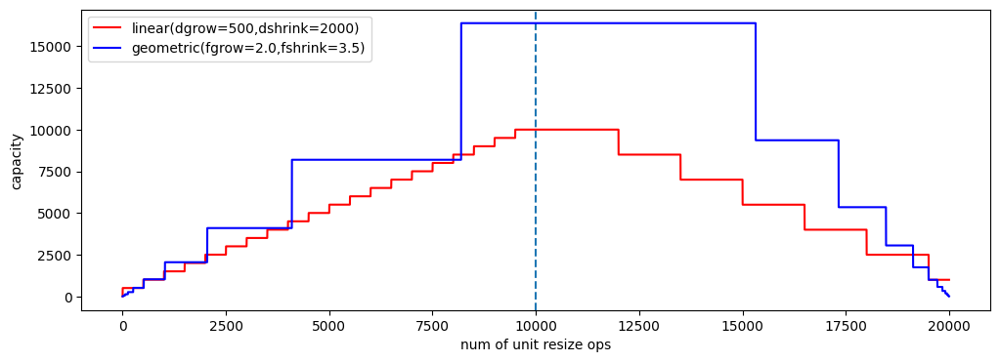

# Corso *Algoritmi e Strutture Dati*: Laboratorio

Gli esercizi di ogni laboratorio sono contenuti in  `asd-labs/<NOME-LAB>/`. 

<!--
I sorgenti indicati nelle istruzioni sono contenuti in `code-python/` (per codice Python) e `code-c` (per codice C).


## Lab 08: Grafi e Alberi

<a name="lab08-graphs"></a>

1. Si consideri il file [`lab08_graphs.py`](code-python/lab08_graphs.py). Viene dato un grafo, creato mediante la libreria **NetworkX**. 
    * Si studi il sorgente fornito: si osservi come viene creato il grafo, e come è strutturata la funzione che si occupa di plottarlo.
        * Si faccia riferimento all [documentazione di NetworkX](https://networkx.org/documentation/stable/reference/index.html)
    * Si implementino le funzioni:
        * `bfv` (visita in ampiezza)
        * `dfv` (visita in profondità)
        * `dijkstra` (annotazione grafo per cammini di costo minimo da un nodo sorgente)
        * `shortest_path` (produzione del cammino di costo minimo da un grafo annotato con Dijkstra)
2. Si consideri il file `binary-trees.c`. Viene data un'implementazione degli alberi binari.
    * Si studi il sorgente fornito: si osservi la definizione della struttura dati, e le implementazioni delle funzioni fornite (ad es. per creare, distruggere, o stampare alberi). 
    * Si implementino le seguenti funzioni: 
        * `binarytree_init`: inizializza un btree con l'array di valori dato
        * `binarytree_visit_postorder`: effettua la visita in profondità post-ordine (nodo corrente dopo i sottoalberi)
        * `binarytree_height`: calcola l'altezza di un btree
        * `binarytree_count_leaves`: conta quante foglie sono presenti in un btree

## Lab 07: Algoritmi di ordinamento
<a name="lab07-sorting"></a>

Si consideri il file `lab07_sorting_algorithms.py`. Include lo scheletro di un programma atto a testare e misurare i tempi d'esecuzione di 5 algoritmi di ordinamento (selection sort, insertion sort, bubble sort, merge sort, quick sort) da implementare.
Si implementino gli algoritmi di ordinamento (facendo riferimento, in caso di difficoltà, alle slide viste a lezione e, in ultima istanza, allo pseudocodice mostrato).

## Lab 06: Hashtable 
<a name="lab06-hashtable"></a>

1. [Tempo stimato: 30'] Hashtable a indirizzamento chiuso (chained)
    - Studiare il sorgente `hashtable-chained.c`
    - Implementare una funzione `HashTable *hashtable_init(int nbuckets, TInfo* entries, int nentries)` che crei e inizializzi una hashtable con le entry fornite
    - Implementare una funzione `HashTable *hashtable_merge(HashTable* h1, HashTable *h2)` che restituisca una nuova hashtable data dall'unione delle due tabelle hash fornite in input.
    - Si scriva un test per verificare le funzionalità implementate.
2. [Tempo stimato: 30'] Si copi il file `hashtable-chained.c` e si vada ad adattare il sorgente per utilizzare il tipo stringa `char*` per le chiavi.
    - Occorre modificare la `typedef`, aggiustare implementazioni di funzioni, e definire una nuova funzione di `hash` (si faccia riferimento alle slide di teoria per un esempio di implementazione)
3. [EXTRA - Tempo stimato: 30'] Esercizio di realtà: esplorare l'implementazione della classe [java.util.HashMap](https://github.com/openjdk/jdk/blob/master/src/java.base/share/classes/java/util/HashMap.java) e cercare di ritrovare concetti introdotti a lezione
4. [EXTRA - Tempo stimato: 90'] Prendendo spunto da `hashtable-chained.c` e da `dynamic-arrays.c`, implementare una hashtable a indirizzamento aperto.
    - Si ricorda che una hashtable a indirizzamento aperto risolve le collisioni andando a occupare bucket successivi della tabella.

## Lab 05: Array dinamici (+ plotting con `matplotlib`)
<a name="lab05-dynamic-arrays"></a>


1. [Tempo stimato: 45'] Array dinamici
    - Studiare il sorgente `dynamic_arrays.c`
    - Completare il sorgente implementando le seguenti funzioni:
        - `darray_resize_linear`: atta ad applicare un'espansione lineare della memoria dell'array dinamico
        - `darray_append`: atta ad aggiungere alla fine dell'array un elemento (ridimensionando l'array)
        - `darray_insert`: atta ad aggiungere alla posizione indicata un nuovo elemento (traslando opportunamenti quelli attualmente presenti)
        - `darray_assert_equals`: atta a verificare con asserzioni che l'array dinamico indicato ha lo stesso contenuto dell'array "tradizionale" fornito
    - Si noti la funzione di `test()` che viene invocata ed eseguita attivando le due modalità di espansione dell'array
    - Nota: si compili con `gcc -DDEBUG dynamic_arrays.c` per attivare log di debug e ispezionare il comportamento delle funzioni di riallocazione
2. [Tempo stimato: 30'] Utilizzare `matplotlib` per graficare come evolve la capacità (memoria allocata) di un array dinamico utilizzando le due tecniche di espansione (lineare e geometrica).
    - Parametrizzare il codice rispetto ai delta, fattori, soglie di crescita/contrazione
    - Ovvero, si cerchi di riprodurre una figura tipo la seguente

3. *[Tempo stimato: 30']* Si utilizzi `matplotlib` per costruire un'immagine simile a quella sottostante
    * Si faccia riferimento alle slide, al [cheatsheet](https://matplotlib.org/cheatsheets/cheatsheets.pdf), alla [guida](https://matplotlib.org/stable/users/explain/quick_start.html), e alla [API Reference](https://matplotlib.org/stable/api/index.html) 
    * Si faccia anche riferimento agli esempi inclusi in [code-python/mpl/](code-python/mpl/)
    * Alcune indicazioni:
        * Si stabilisca un array di funzioni: `functions = [float, math.log, lambda n: n*math.log(n), ...]`
        * Si usi `x_points = np.linspace(...)` per individuare i valori dell'asse `x` da produrre
        * Si produca i punti da graficare per ogni funzione con qualcosa del tipo:
        `y_points = np.array([some_function(x) for x in x_points])`
        * Si plotti `plot(x_points, y_points)`
        * Si può voler limitare l'asse y mediante la funzione `ylim(min,max)`
        * Si usi `Axes#xscale("log")` per impostare una scala logaritmica sull'asse x 
        * Si usi `list(map(f,l))` per produrre una lista applicando `f` ad ogni elemento della lista `l` 
    * Nota: la funzione [gamma](https://en.wikipedia.org/wiki/Gamma_function) è una generalizzazione del fattoriale su valori reali
        * In Python: `math.gamma()`


## Lab 04: Algoritmi di ricerca (+ unit testing e csv)
<a name="lab04-search"></a>


0. [Tempo stimato: 15'] Si osservi il codice d'esempio sull'uso di [`unittest`](https://docs.python.org/3/library/unittest.html) in [`code-python/testing`](code-python/testing).
1. [Tempo stimato: 30'] Implementare in Python l'algoritmo di *ricerca lineare*
    - Testare l'algoritmo 
        - [Opzionale] Usando `unittest` (si scrivano i test in un modulo separato)
    - Misurare i tempi dell'algoritmo su istanze di dimensione diversa
        - NOTA: per la misura dei tempi, si generino (in modo casuale) due categorie di istanze: (1) quelle del *caso medio*, dove l'elemento da trovare è casualmente individuato; e (2) quelle del *caso peggiore*, dove l'elemento da trovare è in posizione peggiore (o non presente).
    - NOTA: si cerchi di rendere il codice di misura dei tempi (e di salvataggio su CSV -- vedi succ.) riusabile
2. [Tempo stimato: 45'] Implementare in Python l'algoritmo di *ricerca binaria*
    - Testare l'algoritmo 
        - [Opzionale] Usando `unittest` (si scrivano i test in un modulo separato)
    - Misurare i tempi dell'algoritmo su istanze di dimensione diversa
3. [Opzionale] Si tenga traccia dei tempi d'esecuzione degli algoritmi implementati nei punti precedenti per valori progressivi di `n` (dimensione dell'istanza) in un file CSV usando il modulo [`csv`](https://docs.python.org/3/library/csv.html)
3. [Tempo stimato: 30'] Si implementi gli algoritmi precedenti (ricerca lineare e ricerca binaria) in modo ricorsivo

-->


## Lab `time` (2024-10-21): Misura dei tempi d'esecuzione di funzioni
<a name="lab-time"></a>

Consultando le slide sulla misura dei tempi d'esecuzione in Python, si svolgano i seguenti esercizi:

0. *[Tempo stimato: 15']* Consultare la pagina [TimeComplexity (python.org)](https://wiki.python.org/moin/TimeComplexity) che documenta la complessità in tempo di varie operazioni su strutture dati nell'implementazione Python `CPython`. Ci si concentri in particulare sulle operazioni su `list`.
    - Si noti come sia importante per chi programma in un linguaggio conoscere la complessità delle funzioni che utilizza.
    - Più avanti nel corso vedremo queste strutture dati e capiremo da dove vengono fuori questi upper bound all'efficienza asintotica
1. *[Tempo stimato: 30']* Si consideri **`measure-fib.py`**. Si misuri e si confronti il tempo d'esecuzione di `fib` (Fibonacci in versione ricorsiva) e `fib_iter` (Fibonacci in versione iterativa). Si utilizzino i *millisecondi* come unità di misura.
    * Si definisca una funzione `measure_running_time(f)` che restituisca il tempo d'esecuzione della funzione `f` fornita in input e la si applichi a `fib` e `fib_iter` per input 10, 20, 30.
        * Si implementi la funzione in due varianti: una usando `time.perf_counter()` e l'altra usando `timeit.repeat`
    * DOMANDA: Quale tra `fib` e `fib_iter` dà luogo a tempi d'esecuzione minori?
    * Esempio di output del programma da implementare:
```
[perf_counter ] fib_rec(5) took 1.347306533716619e-06 sec 	 fib_iter(5) took 1.0011048289015888e-06 sec
[timeit.repeat] fib_rec(5) took 5.810987204313279e-07 sec 	 fib_iter(5) took 4.1349849198013546e-07 sec

[perf_counter ] fib_rec(10) took 7.195401121862233e-06 sec 	 fib_iter(10) took 7.672031642869115e-07 sec
[timeit.repeat] fib_rec(10) took 6.401899736374617e-06 sec 	 fib_iter(10) took 5.166017217561602e-07 sec

...
```
2. *[Tempo stimato: 15']* Si consideri **`profile-function.py`**. Si utilizzi `cProfile` per profilare `function_to_be_profiled()`
    * Qual è la parte più lenta di `function_to_be_profiled()`?
    * Dovresti ottenere un output simile al seguente:
```
### Profiling for n=1000 ###

   ncalls  tottime  percall  cumtime  percall filename:lineno(function)
        1    0.000    0.000    0.000    0.000 cProfile.py:133(__exit__)
        1    0.000    0.000    0.000    0.000 profile-function-sol.py:17(create_list)
        1    0.000    0.000    0.056    0.056 profile-function-sol.py:20(function_to_be_profiled)
        1    0.056    0.056    0.056    0.056 profile-function-sol.py:4(selection_sort)
        2    0.000    0.000    0.000    0.000 {built-in method builtins.len}
        1    0.000    0.000    0.000    0.000 {built-in method builtins.print}
        1    0.000    0.000    0.000    0.000 {method 'disable' of '_lsprof.Profiler' objects}
```
4. *[Tempo stimato: 30']* Si legga la descrizione del progetto [`big-O`](https://pypi.org/project/big-O/)
    * Si rifletta sul problema generale: dedurre la forma/formula di una funzione a partire da punti (e.g., coppie (x,y)). Un approccio è quello della cosiddetta [regression analysis](https://en.wikipedia.org/wiki/Regression_analysis), dove si considera una certa forma di funzione (ad es `ax+b` per una retta), e si cerca di trovare i valori dei parametri `a` e `b` che meglio corrispondano ai dati (*regressione lineare*).
    * Completamento di **`bigo-fib.py`**: si provi, consultando la documentazione, ad applicare il modulo allo scopo di inferire il comportamento asintotico di Fibonacci in versione ricorsiva ed iterativa.
    * Esempio di output atteso:
```
FIB_REC:  Exponential: time = 3.5E-06 * 1.6^n (sec)
FIB_ITER:  Linear: time = -8.5E-05 + 3.6E-06*n (sec)
```


<!--

## Lab 02: Ricorsione in Python
<a name="lab02-recursion"></a>


1. [Tempo stimato: 60'] Studio sorgenti dati
    - `02-recursion-hanoi.py`: implementazione della soluzione ricorsiva al problema della Torre di Hanoi
    - `02-recursion-types.py`: implementazione di algoritmi ricorsivi per le tipologie di ricorsione viste a lezione
2. [Tempo stimato: 60'] Esercizi sulla ricorsione (NOTA: oltre all'implementazione della soluzione, prevedere una serie di test per verificarne la correttezza)
    - Implementare `sum_numbers(a,b)` (somma di tutti i numeri interi compresi tra `a` e `b`) in modo *ricorsivo*
    - Implementare `pow(a,n)` (elevamento a potenza) in modo *ricorsivo*
    - Implementare `list_contains(lst,elem)` (funzione che restituisce `True` se `elem` è contenuto nella lista `lst` o `False` altrimenti) in modo *ricorsivo*
    - Implementare `palindrome(string)` (funzione che restituisce `True` se `string` è una stringa palindroma) in modo *ricorsivo*
        - Un [palindromo](https://it.wikipedia.org/wiki/Palindromo) è una sequenza di caratteri che, letta al contrario, rimane invariata.  Esempio: `emme`, `siris`
    - Implementare `filter(lst,pred)` (funzione che restituisce una nuova lista con soli gli element idi `lst` che soddisfano la funzione predicato `pred`) in modo ricorsivo

<!--

## Lab 01: Semplici algoritmi in Python
<a name="lab01-simple-algorithms"></a>

ISTRUZIONI: leggere attentamente i passi seguenti. Completare ogni passo prima di passare al successivo.

1. [Tempo stimato: 45'] Studio sorgente `01-intro-algorithms.py` 
    - Questo sorgente include implementazioni di algoritmi molto semplici.
    - E' organizzato in modo tale da semplificare il testing di funzioni realizzate, sfruttando una funzion `test`.
    - COSA FARE:
        1. cercare di capire come si comporta il programma (PRIMA DI ESEGUIRE).
        2. eseguire lo script
        3. approfondire la comprensione dello script, consultando slide e/o documentazione
        4. prendere nota di tutti gli elementi nel codice che non sono chiari: 
    - DOMANDA: quale proprietà desiderata degli algoritmi si intende verificare con la funzione `test`?
2. [Tempo stimato: 45'] Estendere il sorgente dato implementando i seguenti algoritmi (con test):
    1. una funzione `fact(n)` per il calcolo del fattoriale di un numero `n` dato
    2. una funzione `compute_perimeter(shape,*kargs)` per il calcolo del perimetro di una forma `shape` sulla base di una sequenza di parametri `kargs` (da passare dipendentemente dalla forma)
        - lo si computi per rettangolo, quadrato, e cerchio
3. [Tempo stimato: 30'] Realizzare un nuovo script che implementi un algoritmo per il gioco `guess-a-number`
    - Di cosa si tratta: è un gioco che coinvolge un banco e un giocatore. Il banco sceglie casualmente un numero segreto da indovinare (ad es. 7). Il giocatore non conosce tale numero, e dispone di un certo numero di tentativi per indovinarlo. Il banco chiede ripetutamente al giocatore un tentativo, fino a vittoria (il giocatore ha indovinato il segreto) o sconfitta (il giocatore ha esaurito il numero di tentativi); ad ogni risposta errata del giocatore, il banco fornisce un indizio, ovvero l'indicazione se il numero tentativo proposto è più grande o più piccolo del segreto; il giocatore può dunque usare tale informazione per correggere il tentativo seguente.
    - Input:
        - range di valori `(min,max)` del gioco
        - numero max di tentativi ammessi
    - Output:
        - stampa in stdout della stringa `WON` in caso di vittoria e della stringa `LOSS` in caso di sconfitta
    - Consigli
        - si veda [`random.randint()`](https://docs.python.org/3/library/random.html?highlight=randint#random.randint)

-->